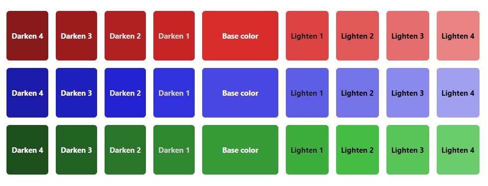
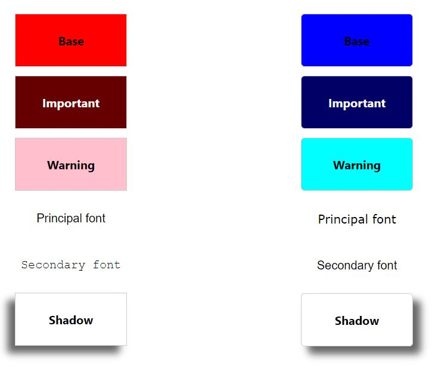
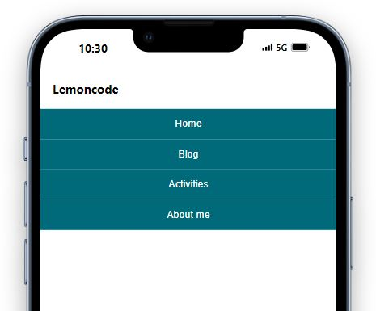
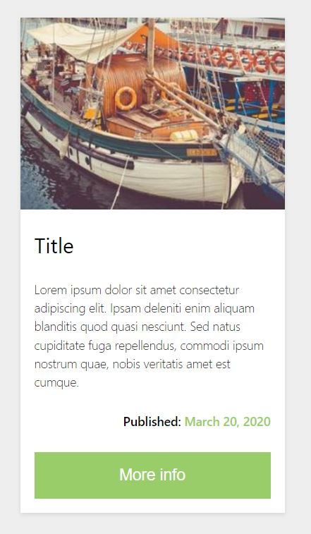

# 01 - Laboratorio Módulo Layout

Cómo arrancar el servidor
````
npm install
npm start
````
Por defecto en el puerto ``http://localhost:3000/`` podremos acceder a los diferentes ejercicios:
- Ejercicio 1: http://localhost:3000/src/01/index.html
- Ejercicio 2: http://localhost:3000/src/02/index.html
- Ejercicio 3: http://localhost:3000/src/03/index.html
- Ejercicio 4: http://localhost:3000/src/04/index.html

Si se desean modificar los ficheros .scss tenemos que ejecutar el comando ``sass -w sass:css`` para que se actualicen los cambios en los ficheros .css de cada ejercicios.

## Algunas capturas de pantalla
### Ejercicio 1: Crear una paleta de colores dinámica.


### Ejercicio 2: Crear dos temas distintos y mostrar los resultados en una página.


### Ejercicio 3: Crear la barra de navegación de la imagen usando Flexbox.


### Ejercicio 4: Crearemos un elemento de tipo card con Grid CSS.
