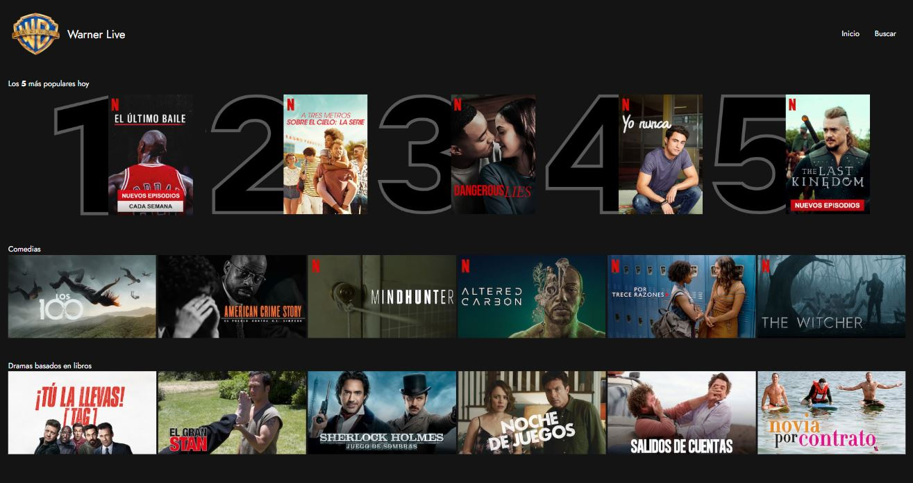
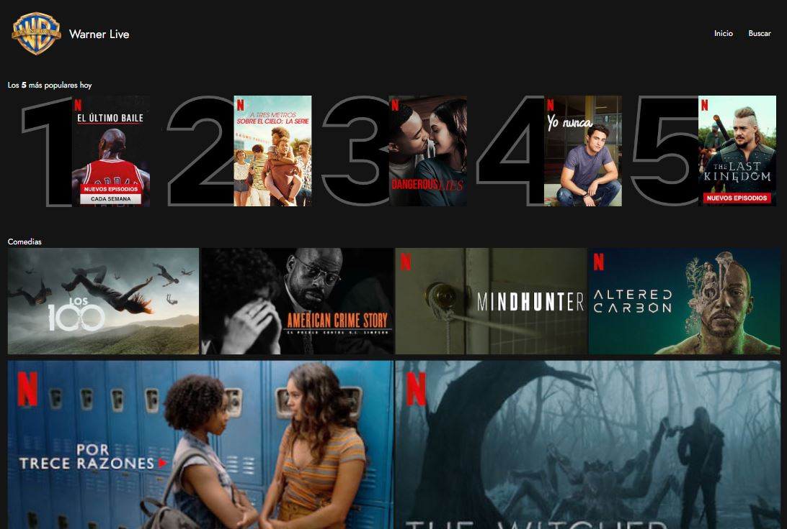
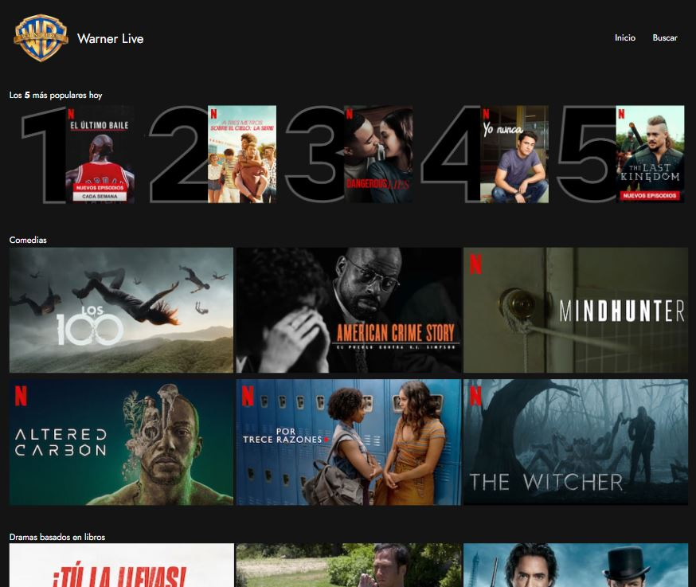
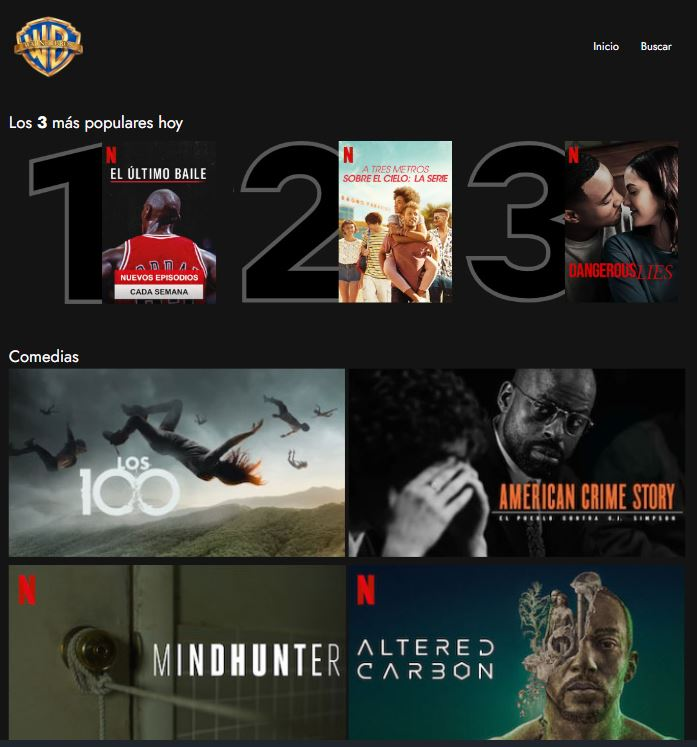

# 01 - Laboratorio EXTRA Módulo Layout

Cómo arrancar el servidor
````
npm install
npm start
````
Por defecto podremos acceder a través del puerto ``http://localhost:3000/``

Si se desean modificar los ficheros .scss tenemos que ejecutar el comando ``sass -w sass:css`` para que se actualicen los cambios en los ficheros .css de cada ejercicios.

## Algunas capturas de pantalla
### 1920 x 1080 px


### 1600 x 1080 px


### 1280 x 1080 px


### 1024 x 1080 px


### > 576 width px
