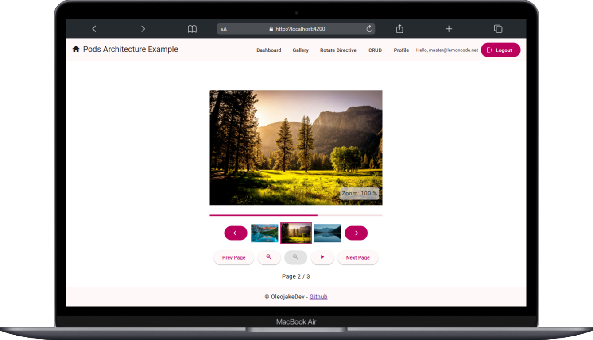

# Angular Gallery Project with Custom Directives

This project was developed using Angular CLI version 18.2.7, and it showcases a fully functional photo gallery application with advanced features such as a custom directive for image rotation and an asynchronous login system with a simulated delay.

This project combines key Angular concepts such as data binding, structural directives, custom directives, asynchronous handling with RxJS, and interactive UI components. The application is fully functional and demonstrates the core skills needed to build dynamic and responsive web applications with Angular.



## Features Implemented

### 1. Photo Gallery

- The photo gallery is built with a dynamic collection of images. The images are stored in an array where each image object contains an id, src (path to the image), and a title.
- The gallery layout is divided into three main sections:
- Selected Image: Displays the larger version of the selected image.
- Image List: Shows the thumbnails of all images in the gallery.
- Control Buttons: Provides interactive buttons (previous, next, zoom in, zoom out, play, stop) for navigating through the gallery and interacting with the images.

### 2. Gallery Functionality

- Upon loading the page, one of the images is automatically displayed in the Selected Image section.
- Users can change the selected image by clicking on any thumbnail in the Image List.
- The Next and Previous buttons allow users to navigate through the gallery.
- The Next button is disabled when the last image is selected.
- The Previous button is disabled when the first image is selected.
- Zoom In and Zoom Out buttons allow the user to adjust the size of the selected image.
- The Play button starts an automatic slideshow, changing the selected image every 2 seconds. The slideshow loops from the first to the last image.
- The Stop button stops the slideshow when active, and is only shown when the slideshow is running.

### 3. Custom Rotate Directive

A custom Rotate Directive was created to rotate images dynamically. This directive enables images to rotate when clicked, with the following features:

- By default, each image rotates by 10 degrees when clicked.
  Users can customize the rotation step and initial angle via the @Input() property.
- The @HostListener listens for click events and applies the corresponding CSS transform property to rotate the image.
- The rotation direction can be reversed if the user holds the Shift key while clicking the image.

### Challenges & Enhancements

- Styling: Custom styles were added to highlight the selected image in the list, making it visually distinct from the others.
- Pagination: The image list was paginated to display three images at a time. The slice pipe in Angular was used, and navigation buttons were added to move between pages of images.
- Custom Directives in Non-Image Elements: The Rotate Directive was applied not just to images but also to other HTML elements such as div, h1, and p to demonstrate the flexibility of the directive.

### Optional Enhancements

#### RxJS & Asynchronous Handling

The login() method in the authentication service was modified to return an Observable<boolean>, simulating an asynchronous response. The response delay was simulated using the RxJS delay operator:

```js
import { of } from "rxjs";
import { delay } from "rxjs/operators";

return of(true).pipe(delay(2000));
return of(false).pipe(delay(2000));
```

The login component was updated to handle this asynchronous response and to show a loading indicator (GIF) during the login process. The loading indicator is shown when the login request is initiated and is hidden once the response is received.

## Setup Instructions

This project was generated with [Angular CLI](https://github.com/angular/angular-cli) version 18.2.7.

## Development server

Run `ng serve` for a dev server. Navigate to `http://localhost:4200/`. The application will automatically reload if you change any of the source files.

## Code scaffolding

Run `ng generate component component-name` to generate a new component. You can also use `ng generate directive|pipe|service|class|guard|interface|enum|module`.

## Build

Run `ng build` to build the project. The build artifacts will be stored in the `dist/` directory.

## Running unit tests

Run `ng test` to execute the unit tests via [Karma](https://karma-runner.github.io).

## Running end-to-end tests

Run `ng e2e` to execute the end-to-end tests via a platform of your choice. To use this command, you need to first add a package that implements end-to-end testing capabilities.

## Further help

To get more help on the Angular CLI use `ng help` or go check out the [Angular CLI Overview and Command Reference](https://angular.dev/tools/cli) page.
